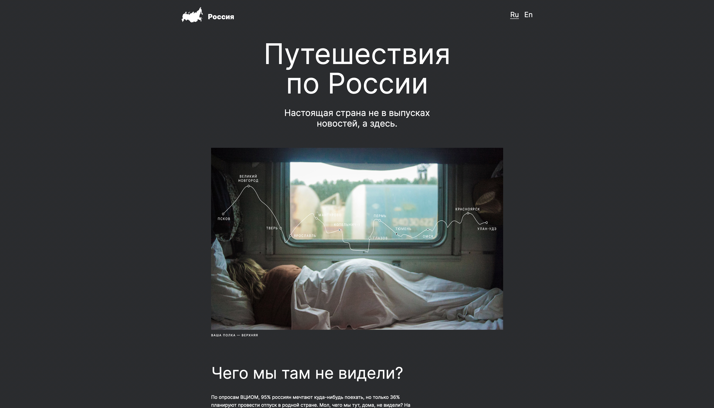

# Путешествия по России (Russian Travel)

## Описание проекта:

Учебный проект в Яндекс.Практикум.
Результат изучения адаптивной вёрстки сайта под различные разрешения экранов.

Проект размещён на [GitHub Pages](https://denisshamanskiy.github.io/russian-travel/ "Путешествия по России")

Макет в [Figma](https://www.figma.com/file/5S2WSbEFL6awjVWJ0NWL8Q/Sprint-3_-Russia-_-desktop-mobile?node-id=28503%3A0 "Макет в Figma")

## В проекте использовались:

- Методология БЭМ
- Flexbox
- Grid
- CSS-директивы

## В дальнейшем планируется добавить:

- Шрифты
- Вендорные префиксы
- Форму для отправки комментариев
